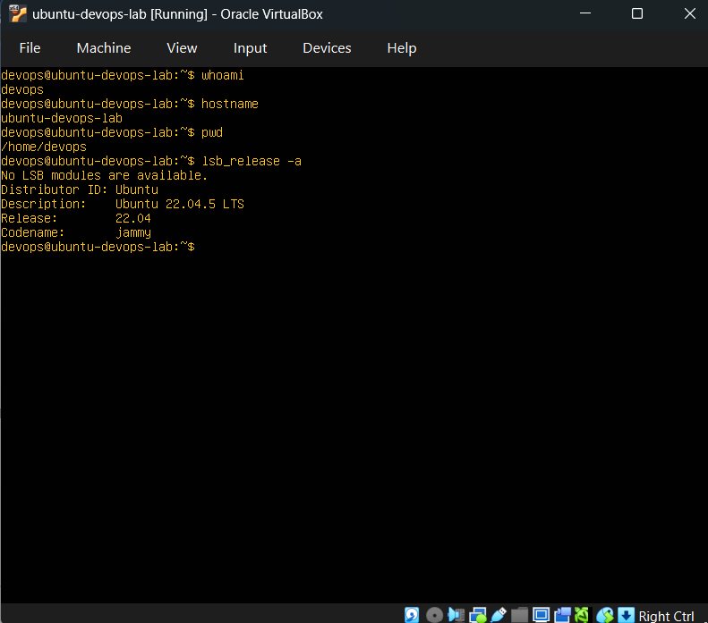
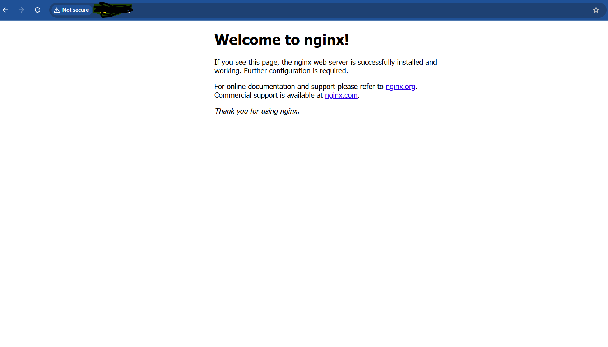
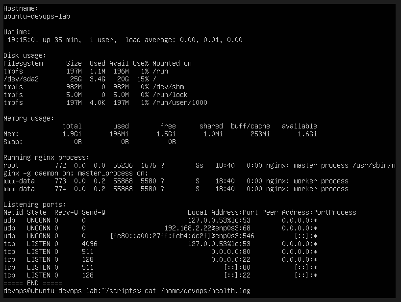

# Setup Notes

## Project Summary

This project is a beginner DevOps lab where I set up an Ubuntu Server virtual machine, installed and managed Nginx, configured basic firewall and SSH settings, created a Bash health-check script, automated it with cron, and documented everything in GitHub.

The goal of this lab was to practice core junior DevOps skills such as Linux administration, service management, logging, permissions, and basic automation.

---

## Step 1 - Ubuntu VM Setup

I created an Ubuntu Server virtual machine to use as my practice server.

### VM Configuration
- RAM: 2 GB
- CPU: 2 cores
- Disk: 25 GB

### Notes
During installation, I created my main user account and enabled OpenSSH Server.

### Result
The VM booted successfully and I was able to log in with my username and password.

---

## Step 2 - Basic Server Information

I collected basic information about the server to confirm it was working properly.

### Commands Used
```bash
whoami - shows the current logged-in user
hostname - shows the server name
pwd - shows the current directory
ip a - shows network interfaces and IP addresses
lsb_release -a - shows the Ubuntu version



## Step 3 - Project Folder Setup

I created the project folder on my laptop and initialized a Git repository.
### commands used 

mkdir linux-demo
cd linux-demo
git init
mkdir notes scripts screenshots
touch README.md notes/setup.md

This folder is the portfolio version of the project. The Ubuntu VM is where I perform server tasks, while the laptop terminal is where I manage the GitHub repository.

## Step 4 - Linux Basics Practice

I practiced basic Linux file and directory commands in the Ubuntu VM.

### Commands Used

pwd
ls -la
cd /tmp
mkdir practice
cd practice
touch file1.txt
echo "hello" > file1.txt
cat file1.txt
cp file1.txt file2.txt
mv file2.txt moved.txt
rm moved.txt

These commands are the foundation of Linux administration. Understanding how files and directories work is necessary before moving into more advanced DevOps tasks.


## Step 5 - Users, Groups, and Permissions

I practiced creating users and groups, then applied file permissions.

### Commands Used

sudo groupadd devops
sudo adduser deployer
sudo usermod -aG devops deployer
id deployer
getent group devops
mkdir -p ~/permission-lab
cd ~/permission-lab
touch app.log
mkdir configs
chmod 644 app.log
chmod 755 configs
sudo chown devops:devops app.log
ls -l

- The deployer user was created
- The devops group was created
- The user was added to the group
- File permissions and ownership were updated successfully

- Every file has an owner and a group
- 644 means the owner can read/write and others can read
- 755 is commonly used for directories and executable scripts
- Permissions are important for both security and stability

## Step 6 - Install and Verify Nginx

I installed Nginx and confirmed that it was running.

### Commands Used

sudo apt update
sudo apt install -y nginx
sudo systemctl status nginx
sudo systemctl enable nginx
sudo systemctl restart nginx
sudo ss -tulpn | grep nginx
ip a

Browser check
I opened the VM IP address in my browser:

http://VM_IP

The Nginx welcome page loaded successfully.


- apt installs packages
- systemctl is used to manage services
- ss -tulpn helps confirm which ports and services are active

## Step 7 - Firewall Configuration

I enabled firewall rules for SSH and web traffic.

### Commands Used

sudo ufw allow OpenSSH
sudo ufw allow 'Nginx Full'
sudo ufw enable
sudo ufw status numbered

The firewall allowed:
- SSH access
- HTTP/HTTPS traffic for Nginx

- A firewall controls incoming traffic. SSH should be allowed before enabling UFW so remote access is not blocked.

## Step 8 - Logs and Troubleshooting

I checked logs to understand how to troubleshoot services.

### Commands Used
cd /var/log/nginx
ls
cat access.log
cat error.log
sudo journalctl -u nginx -n 20
sudo tail -f /var/log/nginx/access.log

I was able to view:
Nginx access logs
Nginx error logs
Service logs from journalctl
access.log shows requests that reached Nginx
error.log shows problems
journalctl shows logs managed by systemd
Logs are one of the most important tools for troubleshooting

## Step 9 - SSH Basics

I checked the SSH service and reviewed the SSH configuration.

Commands Used
sudo systemctl status ssh
sudo nano /etc/ssh/sshd_config
sudo systemctl restart ssh


The SSH service was active.
Remote Access Test
ssh devops@VM_IP

SSH allows remote server management from the laptop terminal. Configuration changes should be made carefully and tested one at a time.

## Step 10 - Bash Health Check Script

I created a Bash script to automate a basic system health check.

Script Location
scripts/health_check.sh
Script
#!/bin/bash
echo "===== SYSTEM HEALTH CHECK ====="
echo "Date: $(date)"
echo
echo "Hostname:"
hostname
echo
echo "Uptime:"
uptime
echo
echo "Disk usage:"
df -h
echo
echo "Memory usage:"
free -h
echo
echo "Running nginx process:"
ps aux | grep nginx | grep -v grep
echo
echo "Listening ports:"
ss -tulpn
echo "===== END ====="
Result

The script ran successfully and displayed:

date
hostname
uptime
disk usage
memory usage
nginx process information
listening ports

Automation saves time and reduces repeated manual work. Even a simple script is useful if I understand what each command does.

## Step 11 - Cron Automation

I scheduled the health-check script to run automatically every 5 minutes.

Cron Entry
*/5 * * * * /home/devops/scripts/health_check.sh >> /home/devops/health.log 2>&1

### Commands Used

crontab -e
sudo systemctl status cron
cat /home/devops/health.log

The cron job ran automatically and appended script output to health.log.

*/5 * * * * means every 5 minutes
>> appends output to a file
2>&1 sends errors to the same log file



## Step 12 - Push to GitHub

I uploaded the finished project to GitHub.

Commands Used
git add .
git commit -m "commit"
git branch -M main
git remote add origin https://github.com/YOUR_USERNAME/repo_name
git push -u origin main

The project was published to GitHub with documentation, scripts, and screenshots.


I used the Ubuntu VM for server administration tasks and my laptop terminal for Git/GitHub tasks.

Here are some problems i encountered during this project :

1. Nginx not opening in the browser
The main issue was making sure the correct VM IP address and network setup were being used.

Solution:
I checked the VM IP address, confirmed Nginx was active, and verified UFW rules.

2. Understanding logs

It took practice to understand where to look when debugging.

Solution:
I used access.log, error.log, and journalctl to understand both successful and failed behavior.

3. Bash scripting

Writing the script from scratch required testing and careful reading.

Solution:
I kept the script simple and focused on useful checks I could explain clearly.

Key Skills Demonstrated

Linux command-line usage
File and directory management
User, group, and permission management
Service management with systemctl
Nginx installation and verification
Firewall configuration with UFW
SSH service checks
Log inspection and troubleshooting
Bash scripting
Cron-based task automation
Git and GitHub documentation

Final Reflection:

This project helped me understand the basics of Linux administration and DevOps workflow. I learned how to install and verify a service, secure access, inspect logs, automate a task, and document my work clearly. It also gave me a practical GitHub project that demonstrates both technical work and my ability to explain what I did.